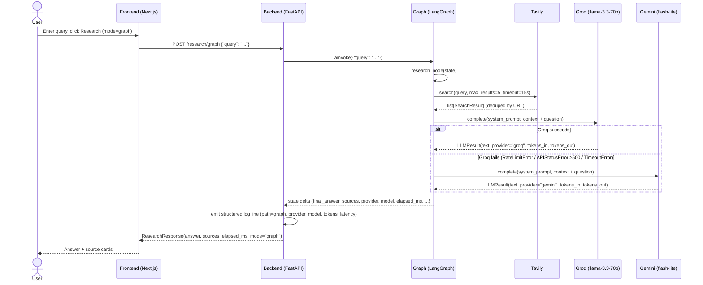
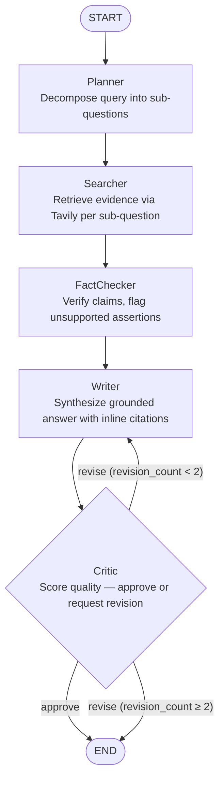

# Agentic Research Assistant — Architecture

## Overview

The system accepts a natural-language research question, retrieves relevant web content via Tavily, and synthesizes a grounded, citation-bearing answer via an LLM (Groq primary, Gemini fallback). It is optimized for two goals: portfolio-quality engineering (typed schemas, sanitized errors, structured telemetry, mocked tests) and a controlled Week 4 evaluation comparing the single-pass RAG baseline against a multi-agent LangGraph pipeline on HotpotQA. As of Week 2, `POST /research/graph` runs a five-node multi-agent graph (Planner → Searcher → FactChecker → Writer → Critic) with a conditional Critic→Writer feedback loop capped at 2 revisions. The baseline endpoint `POST /research` remains locked, giving a clean eval comparison point for Week 4.

---

## Current state (end of Week 1)

*Historical: Week 1 single-node implementation (Day 6).*

Request flow for `POST /research/graph`:



The `POST /research` baseline follows the same Tavily → Groq/Gemini flow but calls it directly (no LangGraph), emitting a log line with `search_latency_ms` as a distinct field.

---

## Current architecture (Week 2)

`POST /research/graph` — five-node multi-agent graph, deployed Day 11:



The Critic → Writer back-edge is guarded by `revision_count`; the hard cap prevents infinite loops. `POST /research` (baseline) stays unchanged throughout.

---

## State schema

From `backend/app/graph/state.py`:

```python
class ResearchState(TypedDict, total=False):
    query: str            # input — caller (Week 1)
    plan: list[str]       # Planner — Week 2
    search_results: list  # Searcher — Week 1 Day 6
    facts: list[str]      # Fact-checker — Week 2
    draft: str            # Writer — Week 2
    critique: str         # Critic — Week 2
    revision_count: int   # Critic loop guard — Week 2
    final_answer: str     # Writer (post-Critic approval) — Week 1 Day 6 (populated directly)
    sources: list         # Searcher — Week 1 Day 6
    elapsed_ms: int       # graph execution time, set by graph wrapper
    provider: str         # LLM provider that served the writer node, for telemetry
    model: str            # LLM model name that served the writer node
    tokens_in: int | None   # LLM input token count — Week 1 Day 6
    tokens_out: int | None  # LLM output token count — Week 1 Day 6
```

`total=False` makes all fields optional — nodes populate only their own slice and return a delta dict; LangGraph merges it into the running state.

| Field | Populated by |
|-------|--------------|
| `query` | Caller — Week 1 |
| `plan` | Planner — Week 2 |
| `search_results` | Searcher (research_node in Week 1) — Week 1 Day 6 |
| `facts` | FactChecker — Week 2 |
| `draft` | Writer — Week 2 |
| `critique` | Critic — Week 2 |
| `revision_count` | Critic (loop guard) — Week 2 |
| `final_answer` | research_node direct / Writer post-Critic — Week 1 Day 6 |
| `sources` | research_node direct / Searcher — Week 1 Day 6 |
| `elapsed_ms` | Graph wrapper — Week 1 Day 6 |
| `provider` | research_node / Writer node — Week 1 Day 6 |
| `model` | research_node / Writer node — Week 1 Day 6 |
| `tokens_in` | research_node / Writer node — Week 1 Day 6 |
| `tokens_out` | research_node / Writer node — Week 1 Day 6 |

---

## Components

**LLM client** (`app/llm/client.py`). `LLMClient` wraps Groq (`llama-3.3-70b-versatile`) as primary and Gemini (`gemini-2.5-flash-lite`) as automatic fallback inside a single `complete()` call. The core design decision is to fail over immediately on any Groq error (rate limit, 5xx, connection failure, 30s timeout) rather than retrying — retrying a degraded provider queues more load on something already failing, while switching providers gets an answer in the same budget window. The singleton is constructed once via `@lru_cache` on `get_llm_client()`, and API keys are held as `SecretStr` to prevent them from appearing in logs or `repr()` output. Failure mode: both providers fail simultaneously, raising `LLMUnavailableError` with a message that names only exception types — raw provider error details are never propagated to callers or HTTP responses.

**Tavily search wrapper** (`app/tools/search.py`). The `search()` function wraps `AsyncTavilyClient` with a 15-second `asyncio.wait_for` timeout and URL-based deduplication before returning up to `max_results` `SearchResult` objects. The design decision is to treat search as a must-succeed step: any Tavily failure raises `SearchUnavailableError` and the endpoint returns 503 rather than falling back to an ungrounded LLM answer, which would be worse. There is no fallback search provider. Failure mode: Tavily latency (~2s average) dominates the total response time; a quota exhaustion or network failure surfaces immediately as a hard 503 with no retry.

**LangGraph workflow** (`app/graph/workflow.py`). As of Week 2, the compiled graph has five nodes wired in sequence with a conditional back-edge from Critic to Writer. The graph is compiled once at module import time and held in a `@lru_cache` singleton (`get_compiled_graph()`), with a module-level `compiled_graph` variable for direct import access. The `route_after_critic` function implements the revision cap: `revision_count >= 2` unconditionally routes to END. Failure mode: exceptions from nodes propagate through `ainvoke()` directly; `SearchUnavailableError` and `LLMUnavailableError` are caught at the endpoint layer; anything else returns 500.

**Agents (Week 2)** (`app/agents/`). Each agent is a module exposing a single `async def run(state: ResearchState) -> dict` function — no classes, no inheritance, no shared state between agents.

- **Planner** (`planner.py`). Decomposes the user query into 2–4 focused sub-questions via a zero-shot LLM prompt with a JSON-array-only output constraint. Falls back to `[query]` on any parse or validation failure so the graph is never blocked by a bad decomposition.
- **Searcher** (`searcher.py`). Runs one Tavily call per sub-question concurrently via `asyncio.gather` (parallelized Day 12), deduplicates results globally by URL, and caps the combined set at 8. Retrieval-only since Day 9 — no LLM call; all synthesis responsibility lives in FactChecker and Writer.
- **FactChecker** (`fact_checker.py`). Extracts `{claim, sources}` pairs from search results using a strict JSON-output LLM prompt. Falls back to an empty facts list on any parse or schema failure rather than fabricating claims. Source IDs are validated against the actual result count before being returned.
- **Writer** (`writer.py`). Synthesizes the final answer from verified facts, citing source numbers inline. On revision passes (`revision_count > 0`), uses a separate system prompt incorporating the Critic's concrete feedback and the previous draft. Short-circuits with a graceful fallback message when `facts` is empty, without calling the LLM.
- **Critic** (`critic.py`). Evaluates the Writer's draft against verified facts on four criteria: groundedness, citation accuracy, completeness, and clarity. Returns `approve` → END or `revise` → Writer (up to the hard cap). Falls back to `approve` on any JSON parse or schema failure — safety over strictness, never an infinite loop.

**FastAPI endpoints** (`app/api/research.py`). Two routes on the `/research` router: `POST ""` (baseline, locked after Day 5) and `POST /graph` (LangGraph path). Both accept `ResearchRequest`, return `ResearchResponse`, and use identical error-handling shapes (503 for `SearchUnavailableError` or `LLMUnavailableError`). The key design decision is that neither endpoint depends on the other's code path — prompt helpers are duplicated rather than shared to prevent coupling that would confound Week 4 eval results. The `mode` field in the response (`"baseline"` vs `"graph"`) lets the eval harness distinguish which path produced a given answer. Failure mode: `workflow.py` is imported at startup, so a syntax error there prevents both endpoints from loading.

**Frontend** (`frontend/app/page.tsx`, `frontend/lib/api.ts`). A single-page Next.js 16 application with a React state machine (query, mode, loading, result, error) and a typed API client that constructs the URL from the `mode` parameter and applies a 30-second `AbortController` timeout. The frontend is intentionally thin — no routing, no state management library, no component library — because the engineering interest is in the backend pipeline. The Baseline/Graph pill toggle maps directly to the two backend endpoints, enabling manual comparison without separate browser tabs. Failure mode: `NEXT_PUBLIC_API_URL` defaults to `localhost:8000`; a production deploy requires the env var to be set and is not validated at build time.

**Test strategy** (`backend/tests/`). All 69 tests mock external services at the module-attribute level via `monkeypatch.setattr`, targeting the specific import path where the function is called (e.g., `app.graph.workflow.search`, not `app.tools.search.search`). The conftest sets dummy API keys at module load time, before any `Settings()` construction is triggered by `TestClient` imports. `asyncio_mode = auto` in `pyproject.toml` means all `async def` test functions run without a decorator. What is not tested: actual network calls to Tavily/Groq/Gemini, real SDK response parsing, Tavily rate-limit behavior, LangGraph checkpoint and streaming APIs, and end-to-end frontend behavior.

---

## Telemetry

Example baseline log line:

```
INFO:app.api.research:Research complete: provider=groq model=llama-3.3-70b-versatile search_results_count=5 search_latency_ms=2041 latency_ms=891 tokens_in=1289 tokens_out=47 total_elapsed_ms=2934
```

Example per-node graph log lines (one line emitted per agent, in execution order):

```
INFO:app.agents.planner:planner_node — plan_size=3 model=llama-3.3-70b-versatile latency_ms=412 tokens_in=312 tokens_out=48
INFO:app.agents.searcher:searcher_node — sub_questions=3 total_search_calls=3 unique_urls=7 final_results=7 parallel=true elapsed_ms=1983
INFO:app.agents.fact_checker:fact_checker_node — facts_count=11 model=llama-3.3-70b-versatile latency_ms=1204 tokens_in=3201 tokens_out=487
INFO:app.agents.writer:writer_node — answer_length=432 revision=False model=llama-3.3-70b-versatile latency_ms=891 tokens_in=1841 tokens_out=112
INFO:app.agents.critic:critic_node — verdict=approve revision_count=0 model=llama-3.3-70b-versatile latency_ms=723 tokens_in=2134 tokens_out=67
```

On a revision pass the Writer log shows `revision=True` and the Critic log shows `revision_count=1`. The Searcher log has no `model` field — it makes no LLM call. The `path=graph` label is on the endpoint-level completion log; per-node logs are prefixed by their own module name for easy log filtering. The baseline line includes `search_latency_ms` and `latency_ms` as separate fields, making it easy to see that Tavily (~2s) dominates Groq (~0.9s). For the Week 4 eval harness, the relevant fields are `provider`, `model`, `tokens_in`, `tokens_out`, and `total_elapsed_ms` / `elapsed_ms` — these will be written to a JSONL eval log alongside the HotpotQA answer, supporting cost and latency comparisons between the baseline and multi-agent paths without modifying the API response schema.

---

## Performance (Day 12)

### Searcher parallelisation

Before Day 12, the Searcher ran one Tavily call per sub-question sequentially. For a 3-sub-question plan this meant ~3 × 2s = ~6s search time before the FactChecker even started. From Day 12, all sub-question calls run concurrently via `asyncio.gather`, so the search phase takes ~2s regardless of plan size (bounded by the slowest single call, not the sum).

```python
# Day 11 — sequential
for sub_q in plan:
    results = await search(sub_q, max_results=max_per_q)

# Day 12 — parallel
results_per_q = await asyncio.wait_for(
    asyncio.gather(*[search(sub_q, max_results=max_per_q) for sub_q in plan]),
    timeout=20.0,
)
```

If any single `search()` call raises `SearchUnavailableError`, `gather` propagates it immediately (default `return_exceptions=False`). A partial answer from surviving sub-questions would be worse than a clear failure, so we fail fast.

### Timeout taxonomy

Every I/O boundary has an explicit timeout. The 504 vs 503 distinction is intentional:

| Layer | Timeout | On expiry |
|-------|---------|-----------|
| Per-Tavily call (`asyncio.wait_for`) | 15 s | `SearchUnavailableError` → 503 |
| Searcher gather (`asyncio.wait_for`) | 20 s | `SearchUnavailableError` → 503 |
| Groq SDK (`AsyncGroq(timeout=...)`) | 30 s | triggers Gemini fallback |
| Gemini call (`asyncio.wait_for`) | 30 s | triggers `LLMUnavailableError` → 503 |
| Baseline endpoint (`asyncio.wait_for`) | 30 s | HTTP **504** |
| Graph endpoint (`asyncio.wait_for`) | 60 s | HTTP **504** |

**503** = a downstream provider (Tavily, Groq, Gemini) is unavailable — the service is healthy but dependencies are not.  
**504** = our own pipeline ran too long — the service and its dependencies are up, but the specific request exceeded the budget.

The graph endpoint gets a more generous cap (60s vs 30s) because in the worst case it runs 3 Writer calls + 3 Critic calls + Planner + FactChecker + one parallel search fan-out.

---

## Evaluation pipeline

The eval harness lives in `backend/eval/hotpot/` and is intentionally excluded from the pytest suite — it requires live APIs (Tavily, Groq) and a running server. All four components have mocked unit tests in `backend/tests/`.

**Loader** (`backend/eval/hotpot/loader.py`). Downloads and caches the HotpotQA dev set (~7,405 questions, distractor setting). Exposes a `HotpotQuestion` dataclass. Context paragraphs from the dataset are excluded — the system retrieves its own evidence via Tavily, so including the dataset's source passages would defeat the eval. Sampling is deterministic by seed with an optional type filter (bridge, comparison, or both).

**Runner** (`backend/eval/hotpot/runner.py`). Calls `POST /research` and `POST /research/graph` sequentially for each question. Output is JSONL with `flush+fsync` per line so a crash mid-run leaves a valid partial file. Resumable on rerun via `question_id` deduplication — already-answered questions are skipped. `--max-retries` (default 3) adds exponential backoff capped at 30s for transient errors (429, 503, 504, network timeouts). `--target` keeps sampling from the same seeded pool until N questions succeed — a safety net when quota exhaustion truncates a run short.

**Scorer** (`backend/eval/hotpot/scorer.py`). Exact Match (EM) and token-level F1 computed by direct reproduction of HotpotQA's official `hotpot_evaluate_v1.py` — same normalization (lowercase, strip punctuation, strip articles a/an/the, collapse whitespace), same EM and F1 logic. Errored entries are skipped when computing means. Output: `scores.json` with per-question scores and per-type (bridge/comparison) aggregates.

**Reporter** (`backend/eval/hotpot/reporter.py`). Renders `scores.json` plus optional runner JSONL into a markdown report. Sections: headline EM/F1 table, per-type breakdown, latency (mean/median/P95), refusal counts (pattern-matched against phrases like "couldn't verify", "cannot be determined"), and sample question pairs spanning the score distribution.

**Test coverage.** 134 tests as of Week 4 Day 20. All eval-component tests are mocked — no network calls in CI.

---

## Known limitations

- Token counting in the Gemini fallback path may return `None` for `tokens_in`/`tokens_out` depending on SDK version; the Week 4 eval harness will use `prompt_token_count` from native API responses.
- No streaming — responses block until the LLM finishes generating; long answers feel slow.
- No caching — every query is a fresh Tavily round-trip and LLM call; identical queries cost the same every time.
- No rate limiting on the API — a runaway client can exhaust Tavily and Groq quotas.
- No auth on any endpoint.
- No persistence — every query is stateless; there is no query history, session, or user model.
- 30-second timeout on LLM calls can be hit by very long Tavily responses that push the context window near the model's limit.
- Sources cited can be low quality. RAG can produce confidently-cited hallucinations when the retrieved sources are speculative or wrong — observed during Day 5 manual testing with a query about future model release dates.
- Graph latency varies widely (3–26s observed across smoke eval queries); no defined p95 budget or short-circuit path for simple queries before deployment.
- Soft hallucinations remain possible when retrieved sources themselves contain speculative claims. The Critic evaluates the draft against the retrieved facts, not against ground truth — a misleading source that makes it through Searcher can persist to the final answer (observed on q03 Tailwind comparison in smoke eval).
- Critic does not apply a source-quality signal. All Tavily results are treated as equally credible; speculative or opinionated sources are weighted the same as official documentation.
- HotpotQA EM rewards terse single-word answers; both systems produce verbose prose so EM trends to 0 even when answers are substantively correct. Refusal tracking exists to partially compensate.
- Open-web retrieval via Tavily differs from HotpotQA's original closed-book setup — absolute EM/F1 numbers are not directly comparable to published baselines.
- Free-tier provider quotas (Groq, Tavily) impose a practical ceiling on single-run sample size. Day 21's 200-question run completed only 32 before quota exhaustion.
- Planner entity-resolution failures (e.g. "No. 1455 Flight" → Southwest Airlines flight 1455) propagate through Searcher → FactChecker → Writer with no recovery path.

---

## Decisions worth defending

| Decision | Why this | Why not the alternative |
|----------|----------|------------------------|
| Groq primary, Gemini fallback | Groq is the fastest free-tier inference for Llama-3 (sub-second on most queries); the Gemini fallback provides provider diversity so a Groq outage does not take down the system | OpenAI-only: no free tier at the required throughput; random load balancing across providers: adds non-determinism that makes eval results harder to attribute to a specific model |
| LangGraph for orchestration | Provides a typed state machine with built-in conditional routing and clear graph topology; used in production agent systems and well-documented for exactly this use case | Vanilla LangChain (no state graph): harder to add conditional edges and revision loops without custom control flow; fully custom orchestration: re-invents a tested primitive and adds hundreds of lines to maintain |
| Tavily for search | Purpose-built for LLM retrieval — returns clean deduplicated snippets with relevance scores rather than raw HTML; `AsyncTavilyClient` is async-native and compatible with FastAPI | SerpAPI: commercial, requires HTML parsing for snippet extraction; Brave Search API: similar quality but less LLM-optimized and fewer API docs; DuckDuckGo: no official API, scraping-based, brittle under load |
| Single-node graph in Week 1 (before adding agents) | Establishes LangGraph plumbing — state schema, compiled graph, `ainvoke` wiring, endpoint — on a trivial case before adding complexity; makes Week 2 bugs attributable to agent logic rather than graph setup | Skipping straight to multi-agent: the first time the graph has bugs it is hard to separate LangGraph issues from agent-logic issues; the trivial week makes debugging faster |
| Mocked tests only, no integration tests against real APIs | Tests run in 1.7s with no network and no keys in CI; mocks are precise enough to test error-handling paths (rate limits, 5xx) that are hard to trigger reliably with real APIs | Hitting real APIs in CI: slow (~5–10s per test), flaky on rate limits, expensive at scale, impossible without secrets in the test environment; the tradeoff is that mocks do not catch SDK-level parsing bugs |
| `SecretStr` + `lru_cache` settings | `SecretStr` prevents keys from appearing in `repr()` or accidental log calls; `lru_cache` on `get_settings()` and `get_llm_client()` ensures one Settings parse and one SDK client construction per process lifetime | Reading env vars directly per request: keys visible in any `str()` output; constructing SDK clients per request: measurable startup overhead on every API call, and multiple client instances can race on connection pool limits |
| FactChecker → Writer split (Day 10) | Each prompt has one job: claim extraction or synthesis. Separating them makes it possible to attribute quality failures to the right step in telemetry, and each prompt fits on one screen | A single "extract-and-synthesize" node: one fewer LLM call per query, but failures are ambiguous — impossible to tell whether the extraction or the synthesis degraded the answer |
| Critic falls back to `approve` on parse failure (Day 11) | Safety over strictness: shipping an unreviewed draft is no worse than having no Critic at all; an uncaught exception or infinite loop would be catastrophically worse. Only `LLMUnavailableError` propagates to the caller | Raising on parse failure: surfaces the bug but crashes a user-facing request; retrying: adds latency without fixing the underlying LLM output quality |
| Searcher parallelized via `asyncio.gather` (Day 12) | Cuts the search phase from ~N×2s to ~2s (bounded by the slowest single call, not the sum); 20s gather timeout bounds worst-case fan-out while still failing fast on Tavily errors | Threading: unnecessary overhead — Tavily calls are I/O-bound and asyncio handles them natively; sequential: ~6s search for a 3-element plan before FactChecker even starts |
| 504 vs 503 status codes (Day 12) | Distinct semantics: 503 = downstream provider down (check Tavily/Groq status page); 504 = our pipeline exceeded its time budget (check query complexity). Mixing them makes on-call diagnosis slower | Single 500 for all failures: loses the signal about whether the problem is ours or a dependency's |

---

## Repo layout 

```
agentic-research-assistant/
├── backend/                  # FastAPI app, LangGraph graph, pytest suite
│   ├── app/
│   │   ├── api/              # FastAPI routers — research endpoints (baseline + graph)
│   │   ├── graph/            # LangGraph ResearchState TypedDict and compiled workflow
│   │   ├── llm/              # LLM client: Groq primary, Gemini fallback, LLMUnavailableError
│   │   ├── tools/            # External tool wrappers: Tavily search, SearchUnavailableError
│   │   ├── config.py         # pydantic-settings Settings, lru_cache singleton
│   │   ├── main.py           # FastAPI app factory, CORS, /health endpoint
│   │   └── schemas.py        # Shared Pydantic v2 models (Source, ResearchRequest, ResearchResponse)
│   ├── tests/                # Pytest suite — all mocked, asyncio_mode=auto, 69 tests
│   └── venv/                 # Python 3.13 virtual environment (not committed)
├── docs/                     # Architecture document and week retrospectives
└── frontend/                 # Next.js 16 + Tailwind v4 single-page frontend
    ├── app/                  # Next.js app-router pages (page.tsx — query UI + mode toggle)
    └── lib/                  # Typed API client with AbortController timeout (api.ts)
```
