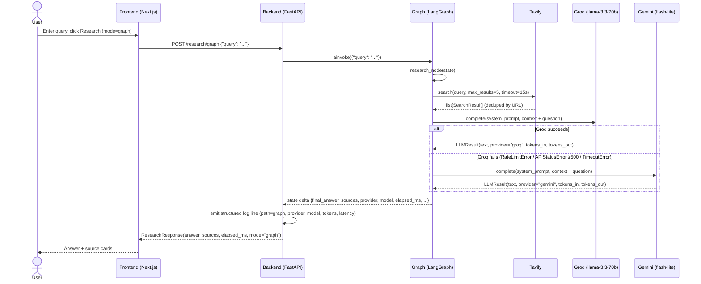
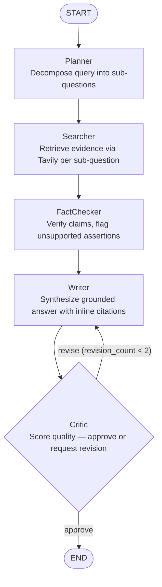

# Agentic Research Assistant — Architecture

## Overview

The system accepts a natural-language research question, retrieves relevant web content via Tavily, and synthesizes a grounded, citation-bearing answer via an LLM (Groq primary, Gemini fallback). It is optimized for two goals: portfolio-quality engineering (typed schemas, sanitized errors, structured telemetry, mocked tests) and a controlled Week 4 evaluation comparing the single-pass RAG baseline against a multi-agent LangGraph pipeline on HotpotQA. At the end of Week 1 the system has two endpoints — `POST /research` (baseline, locked) and `POST /research/graph` (currently a single-node graph wrapping the same pipeline) — so the evaluation infrastructure is wired up before the multi-agent logic exists. By Week 6, `POST /research/graph` will run a five-node agent graph (Planner → Searcher → FactChecker → Writer → Critic); the baseline endpoint is never modified, giving a clean eval comparison point.

---

## Current state (end of Week 1)

Request flow for `POST /research/graph`:



The `POST /research` baseline follows the same Tavily → Groq/Gemini flow but calls it directly (no LangGraph), emitting a log line with `search_latency_ms` as a distinct field.

---

## Target state (end of Week 6)

`POST /research/graph` — five-node multi-agent graph:



The Critic → Writer back-edge is guarded by `revision_count`; the hard cap prevents infinite loops. `POST /research` (baseline) stays unchanged throughout.

---

## State schema

From `backend/app/graph/state.py`:

```python
class ResearchState(TypedDict, total=False):
    query: str            # input — caller (Week 1)
    plan: list[str]       # Planner — Week 2
    search_results: list  # Searcher — Week 1 Day 6
    facts: list[str]      # Fact-checker — Week 2
    draft: str            # Writer — Week 2
    critique: str         # Critic — Week 2
    revision_count: int   # Critic loop guard — Week 2
    final_answer: str     # Writer (post-Critic approval) — Week 1 Day 6 (populated directly)
    sources: list         # Searcher — Week 1 Day 6
    elapsed_ms: int       # graph execution time, set by graph wrapper
    provider: str         # LLM provider that served the writer node, for telemetry
    model: str            # LLM model name that served the writer node
    tokens_in: int | None   # LLM input token count — Week 1 Day 6
    tokens_out: int | None  # LLM output token count — Week 1 Day 6
```

`total=False` makes all fields optional — nodes populate only their own slice and return a delta dict; LangGraph merges it into the running state.

| Field | Populated by |
|-------|--------------|
| `query` | Caller — Week 1 |
| `plan` | Planner — Week 2 |
| `search_results` | Searcher (research_node in Week 1) — Week 1 Day 6 |
| `facts` | FactChecker — Week 2 |
| `draft` | Writer — Week 2 |
| `critique` | Critic — Week 2 |
| `revision_count` | Critic (loop guard) — Week 2 |
| `final_answer` | research_node direct / Writer post-Critic — Week 1 Day 6 |
| `sources` | research_node direct / Searcher — Week 1 Day 6 |
| `elapsed_ms` | Graph wrapper — Week 1 Day 6 |
| `provider` | research_node / Writer node — Week 1 Day 6 |
| `model` | research_node / Writer node — Week 1 Day 6 |
| `tokens_in` | research_node / Writer node — Week 1 Day 6 |
| `tokens_out` | research_node / Writer node — Week 1 Day 6 |

---

## Components

**LLM client** (`app/llm/client.py`). `LLMClient` wraps Groq (`llama-3.3-70b-versatile`) as primary and Gemini (`gemini-2.5-flash-lite`) as automatic fallback inside a single `complete()` call. The core design decision is to fail over immediately on any Groq error (rate limit, 5xx, connection failure, 30s timeout) rather than retrying — retrying a degraded provider queues more load on something already failing, while switching providers gets an answer in the same budget window. The singleton is constructed once via `@lru_cache` on `get_llm_client()`, and API keys are held as `SecretStr` to prevent them from appearing in logs or `repr()` output. Failure mode: both providers fail simultaneously, raising `LLMUnavailableError` with a message that names only exception types — raw provider error details are never propagated to callers or HTTP responses.

**Tavily search wrapper** (`app/tools/search.py`). The `search()` function wraps `AsyncTavilyClient` with a 15-second `asyncio.wait_for` timeout and URL-based deduplication before returning up to `max_results` `SearchResult` objects. The design decision is to treat search as a must-succeed step: any Tavily failure raises `SearchUnavailableError` and the endpoint returns 503 rather than falling back to an ungrounded LLM answer, which would be worse. There is no fallback search provider. Failure mode: Tavily latency (~2s average) dominates the total response time; a quota exhaustion or network failure surfaces immediately as a hard 503 with no retry.

**LangGraph workflow** (`app/graph/workflow.py`). In Week 1, the compiled graph has a single `research_node` that runs the full baseline pipeline (search → prompt-build → generate) and returns a state delta. The graph is compiled once at module import time and held in a `@lru_cache` singleton (`get_compiled_graph()`), with a module-level `compiled_graph` variable for direct import access. The Week 1 graph exists specifically to establish LangGraph plumbing — state schema, compiled graph, `ainvoke` wiring, and the `/graph` endpoint — before any agent logic is added in Week 2. Failure mode: exceptions from the node propagate through `ainvoke()` directly; `SearchUnavailableError` and `LLMUnavailableError` are caught at the endpoint layer; anything else returns 500.

**FastAPI endpoints** (`app/api/research.py`). Two routes on the `/research` router: `POST ""` (baseline, locked after Day 5) and `POST /graph` (LangGraph path). Both accept `ResearchRequest`, return `ResearchResponse`, and use identical error-handling shapes (503 for `SearchUnavailableError` or `LLMUnavailableError`). The key design decision is that neither endpoint depends on the other's code path — prompt helpers are duplicated rather than shared to prevent coupling that would confound Week 4 eval results. The `mode` field in the response (`"baseline"` vs `"graph"`) lets the eval harness distinguish which path produced a given answer. Failure mode: `workflow.py` is imported at startup, so a syntax error there prevents both endpoints from loading.

**Frontend** (`frontend/app/page.tsx`, `frontend/lib/api.ts`). A single-page Next.js 16 application with a React state machine (query, mode, loading, result, error) and a typed API client that constructs the URL from the `mode` parameter and applies a 30-second `AbortController` timeout. The frontend is intentionally thin — no routing, no state management library, no component library — because the engineering interest is in the backend pipeline. The Baseline/Graph pill toggle maps directly to the two backend endpoints, enabling manual comparison without separate browser tabs. Failure mode: `NEXT_PUBLIC_API_URL` defaults to `localhost:8000`; a production deploy requires the env var to be set and is not validated at build time.

**Test strategy** (`backend/tests/`). All 23 tests mock external services at the module-attribute level via `monkeypatch.setattr`, targeting the specific import path where the function is called (e.g., `app.graph.workflow.search`, not `app.tools.search.search`). The conftest sets dummy API keys at module load time, before any `Settings()` construction is triggered by `TestClient` imports. `asyncio_mode = auto` in `pyproject.toml` means all `async def` test functions run without a decorator. What is not tested: actual network calls to Tavily/Groq/Gemini, real SDK response parsing, Tavily rate-limit behavior, LangGraph checkpoint and streaming APIs, and end-to-end frontend behavior.

---

## Telemetry

Example baseline log line:

```
INFO:app.api.research:Research complete: provider=groq model=llama-3.3-70b-versatile search_results_count=5 search_latency_ms=2041 latency_ms=891 tokens_in=1289 tokens_out=47 total_elapsed_ms=2934
```

Example graph log line:

```
INFO:app.api.research:Research graph complete: path=graph provider=groq model=llama-3.3-70b-versatile search_results_count=5 elapsed_ms=3102 tokens_in=1302 tokens_out=53
```

The graph line includes `path=graph` for log filtering by mode. The baseline line includes `search_latency_ms` and `latency_ms` as separate fields, making it easy to see that Tavily (~2s) dominates Groq (~0.9s). For the Week 4 eval harness, the relevant fields are `provider`, `model`, `tokens_in`, `tokens_out`, and `total_elapsed_ms` / `elapsed_ms` — these will be written to a JSONL eval log alongside the HotpotQA answer, supporting cost and latency comparisons between the baseline and multi-agent paths without modifying the API response schema.

---

## Known limitations

- Token counting in the Gemini fallback path may return `None` for `tokens_in`/`tokens_out` depending on SDK version; the Week 4 eval harness will use `prompt_token_count` from native API responses.
- No streaming — responses block until the LLM finishes generating; long answers feel slow.
- No caching — every query is a fresh Tavily round-trip and LLM call; identical queries cost the same every time.
- No rate limiting on the API — a runaway client can exhaust Tavily and Groq quotas.
- No auth on any endpoint.
- No persistence — every query is stateless; there is no query history, session, or user model.
- 30-second timeout on LLM calls can be hit by very long Tavily responses that push the context window near the model's limit.
- Single LangGraph node means no agent specialization — the Planner, FactChecker, and Critic nodes from the Week 6 target do not exist yet.
- Sources cited can be low quality. RAG can produce confidently-cited hallucinations when the retrieved sources are speculative or wrong — observed during Day 5 manual testing with a query about future model release dates.

---

## Decisions worth defending

| Decision | Why this | Why not the alternative |
|----------|----------|------------------------|
| Groq primary, Gemini fallback | Groq is the fastest free-tier inference for Llama-3 (sub-second on most queries); the Gemini fallback provides provider diversity so a Groq outage does not take down the system | OpenAI-only: no free tier at the required throughput; random load balancing across providers: adds non-determinism that makes eval results harder to attribute to a specific model |
| LangGraph for orchestration | Provides a typed state machine with built-in conditional routing and clear graph topology; used in production agent systems and well-documented for exactly this use case | Vanilla LangChain (no state graph): harder to add conditional edges and revision loops without custom control flow; fully custom orchestration: re-invents a tested primitive and adds hundreds of lines to maintain |
| Tavily for search | Purpose-built for LLM retrieval — returns clean deduplicated snippets with relevance scores rather than raw HTML; `AsyncTavilyClient` is async-native and compatible with FastAPI | SerpAPI: commercial, requires HTML parsing for snippet extraction; Brave Search API: similar quality but less LLM-optimized and fewer API docs; DuckDuckGo: no official API, scraping-based, brittle under load |
| Single-node graph in Week 1 (before adding agents) | Establishes LangGraph plumbing — state schema, compiled graph, `ainvoke` wiring, endpoint — on a trivial case before adding complexity; makes Week 2 bugs attributable to agent logic rather than graph setup | Skipping straight to multi-agent: the first time the graph has bugs it is hard to separate LangGraph issues from agent-logic issues; the trivial week makes debugging faster |
| Mocked tests only, no integration tests against real APIs | Tests run in 1.7s with no network and no keys in CI; mocks are precise enough to test error-handling paths (rate limits, 5xx) that are hard to trigger reliably with real APIs | Hitting real APIs in CI: slow (~5–10s per test), flaky on rate limits, expensive at scale, impossible without secrets in the test environment; the tradeoff is that mocks do not catch SDK-level parsing bugs |
| `SecretStr` + `lru_cache` settings | `SecretStr` prevents keys from appearing in `repr()` or accidental log calls; `lru_cache` on `get_settings()` and `get_llm_client()` ensures one Settings parse and one SDK client construction per process lifetime | Reading env vars directly per request: keys visible in any `str()` output; constructing SDK clients per request: measurable startup overhead on every API call, and multiple client instances can race on connection pool limits |

---

## Repo layout

```
agentic-research-assistant/
├── backend/                  # FastAPI app, LangGraph graph, pytest suite
│   ├── app/
│   │   ├── api/              # FastAPI routers — research endpoints (baseline + graph)
│   │   ├── graph/            # LangGraph ResearchState TypedDict and compiled workflow
│   │   ├── llm/              # LLM client: Groq primary, Gemini fallback, LLMUnavailableError
│   │   ├── tools/            # External tool wrappers: Tavily search, SearchUnavailableError
│   │   ├── config.py         # pydantic-settings Settings, lru_cache singleton
│   │   ├── main.py           # FastAPI app factory, CORS, /health endpoint
│   │   └── schemas.py        # Shared Pydantic v2 models (Source, ResearchRequest, ResearchResponse)
│   ├── tests/                # Pytest suite — all mocked, asyncio_mode=auto, 23 tests
│   └── venv/                 # Python 3.13 virtual environment (not committed)
├── docs/                     # Architecture document and week retrospectives
└── frontend/                 # Next.js 16 + Tailwind v4 single-page frontend
    ├── app/                  # Next.js app-router pages (page.tsx — query UI + mode toggle)
    └── lib/                  # Typed API client with AbortController timeout (api.ts)
```
